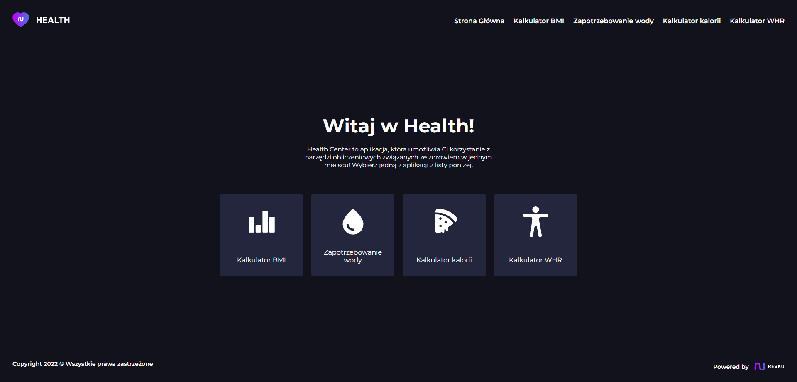
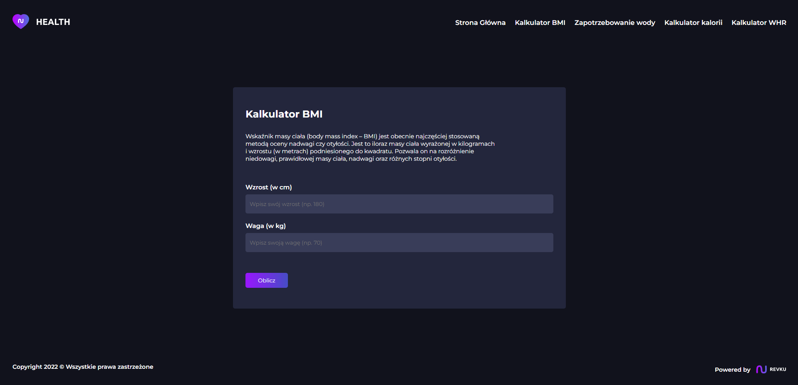
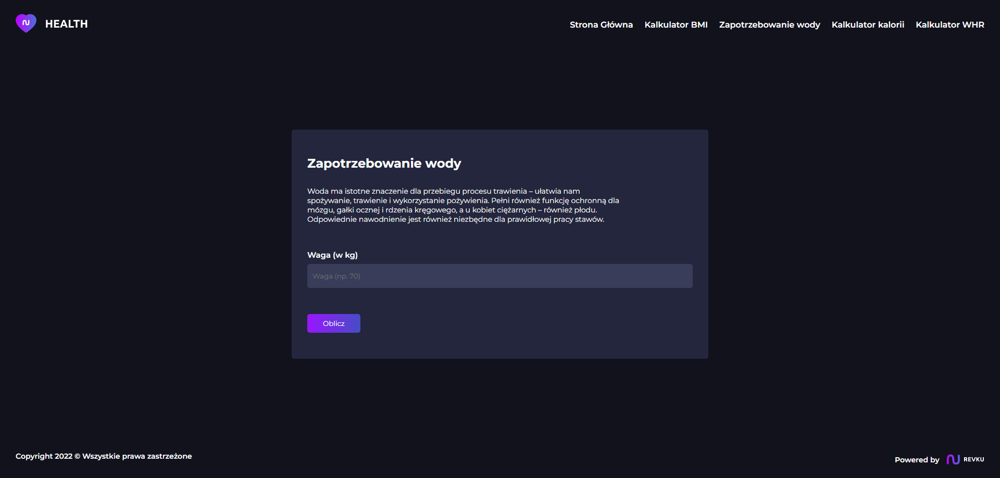
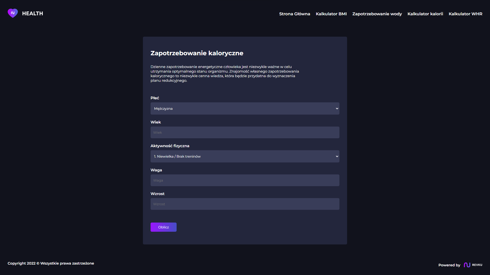
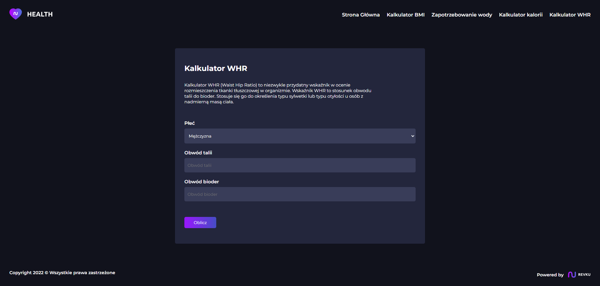

# ❤️ Health Center
Health Center is an app that puts you in one place to use health-related calculation tools!   

## 🔧 Tech stack
- React
- create-react-app
- styled-components

## 📝 Features
- BMI Calculator
- Calories Calculator
- Water Calculator
- WHR Calculator

## 👋 Getting Started
1. Clone the repository   
```
git clone https://github.com/Revku/sleep-calulator
```  
2. Install all depencencies   
```   
npm install
```   
3. Start application   
```
npm start
```   

## 📸 Screenshots
   
   
   
   
   